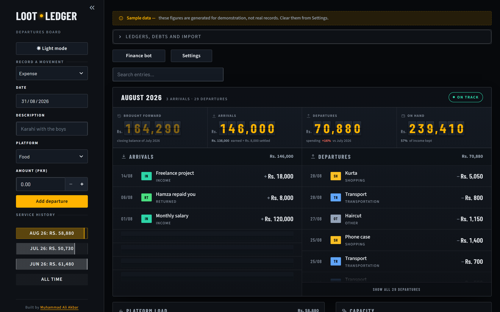
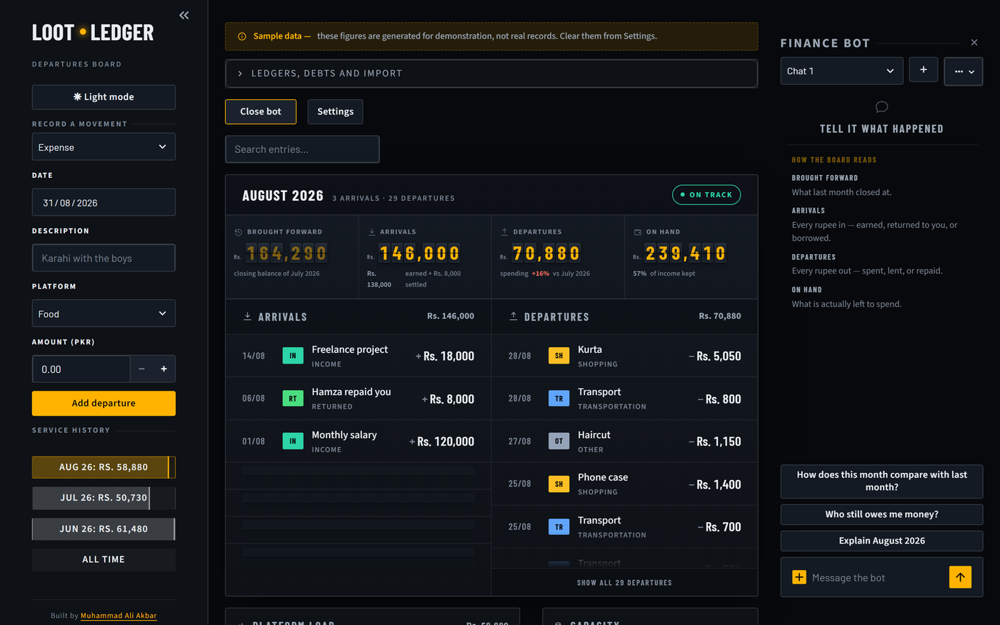

# Loot Ledger

A personal cash tracker built as a station **departure board**: money arriving and
money leaving read as arrivals and departures on one enamel panel, with each
month opening on the balance the last one closed at.

Streamlit + SQLite, hand-authored SVG charts, and a Gemini-backed Finance Bot
that can write to the ledgers from a plain sentence, a spreadsheet, or a photo
of a receipt.

Built by [Muhammad Ali Akbar](https://www.linkedin.com/in/muhammad-ali-akbar-khan-7b37b8197).



<sub>Shown with generated sample data — the banner says so on screen. No real
records appear in any screenshot.</sub>

---

## What it does

**The board.** Four split-flap figures across the top — brought forward,
arrivals, departures, on hand — over two opposed columns listing every movement
with its platform (category), date and amount. A status lamp reports the period
as on track, running warm, over budget, or no service.

**Real carryover.** Months are not islands. Each month opens on the previous
month's closing balance, so a good month visibly funds the next one. An
**opening balance** seeds the first month for savings that predate the board,
without inventing a transaction that never happened.

**Honest debt maths.** Lending is cash leaving now; being repaid is cash coming
back. Borrowing is cash arriving; repaying is cash leaving. A debt opened and
settled inside one month nets to nothing, so by default it is kept out of both
headline totals rather than inflating each by its value — a toggle in Settings
restores both legs. Outstanding obligations are reported separately from
spendable cash.

**Light and dark.** A full contrast inversion, not a colour swap. The split-flap
tiles stay dark in both modes on purpose: they are the physical mechanism of the
board, and a real one does not change colour when the room does.

**Five display currencies.** PKR, USD, GBP, EUR and AED, converted on the way to
the screen only. Records stay stored in rupees exactly as entered, so switching
back restores the original figures precisely. Rates refresh once a day and fall
back to the last known set when offline.

**Budgets and pacing.** A monthly cap per category, drawn as a capacity bar on
the Platform Load panel, plus a projected month-end close from the current daily
burn.

**Recurring entries and debt ageing.** Rent, subscriptions and salary are logged
from a template once their day arrives. Unsettled debts past 30 days are called
out with the number of days they have been outstanding.



**The Finance Bot.** Streams its replies and holds live tool access:
`log_expense`, `log_transport`, `log_income`, `log_lent`, `log_borrowed`,
`settle_debt`, plus read tools (`month_summary`, `list_open_debts`) so it can
answer about months that are not on screen. It cites the figures it used.
Conversations survive a refresh. The free tier meters requests per model per
day, so the bot walks a chain of models rather than failing when one runs dry.

**CSV and Excel import.** Drop in a sheet and every block of columns goes to the
ledger it belongs to — spending, income, lent and borrowed all land in one pass.
Handles multi-sheet workbooks, banner rows above the real header, several date
formats, currency noise, and totals rows (which are recognised, not banked).

**Backup.** Every record in every ledger as one flat CSV, readable in any
spreadsheet and re-importable section by section.

**Sample data.** Three months of generated records so the board can be seen with
data in it. Labelled with a banner the whole time it is loaded, and one click to
clear. Nothing generated is ever presented as a real record.

---

## Setup

```bash
pip install -r requirements.txt
```

Add your Gemini API key to `.streamlit/secrets.toml`:

```toml
GEMINI_API_KEY = "your-key-here"
# optional — any model your key can reach
GEMINI_MODEL = "gemini-3.5-flash-lite"
```

The board works fully without a key. Only the Finance Bot needs one, and it says
so plainly when the key is missing.

### Running it

```bash
python -m streamlit run app.py
```

`python -m streamlit` rather than a bare `streamlit`, which is not on PATH in
every install. On Windows, **`Start Loot Ledger.vbs`** does the same thing with
no console window and opens the browser for you; **`Stop Loot Ledger.bat`**
shuts the server down.

Opens at `http://localhost:8501`. Data lives in `tracker.db`, created on first
run.

There is deliberately **no `server.baseUrlPath`**. It used to be set, and on a
host that does its own routing the app is served at a subdomain root instead —
so every asset request resolved one directory too deep, the frontend never
mounted, and the page showed a bare error with no traceback under it.

Set `LOOT_LEDGER_DB` to point at a different SQLite file — useful for running a
scratch instance beside your real one.

> **Your data never leaves the folder.** `tracker.db`, any spreadsheet you
> import, and `.streamlit/secrets.toml` are all gitignored. Keep it that way:
> the database holds your complete financial history and the secrets file holds
> a live API key.

### Reaching it from your phone

The deployed copy on Streamlit Community Cloud is a **sample board, not your
ledger** — it seeds generated records and says so. That is deliberate. A
Community Cloud app answers to anyone holding the URL, so putting a real
financial history behind that link would publish it; the fact that its storage
resets on every reboot was quietly protecting you.

To use the real board on a phone, reach the machine it already runs on:

1. Install [Tailscale](https://tailscale.com/) on the laptop and the phone and
   sign both into the same account. The laptop gets a stable private address
   that only your devices can reach.
2. Start the app so it listens beyond localhost:
   ```bash
   python -m streamlit run app.py --server.address 0.0.0.0
   ```
3. Open `http://<tailscale-address>:8501` on the phone.

**Put a gate in front of it first.** Once the app is reachable from anywhere it
needs one, even on a private network — set `LOOT_LEDGER_PASSWORD` in
`.streamlit/secrets.toml`, or configure the `[auth]` block for a real Google
sign-in. Both are described in `.streamlit/secrets.toml.example`. The check runs
before the page renders, so nothing is served to an unauthenticated visitor —
not a figure, not a name. With neither set the app stays open, which is the
right default on a laptop nothing can reach.

---

## Layout

| File | Holds |
|---|---|
| `app.py` | Composition and layout. Opens with the direction contract. |
| `theme.py` | Design tokens and the whole stylesheet — the visual world. |
| `icons.py` | Authored SVG icon set: one 24 grid, one 1.6 stroke weight. |
| `finance.py` | The money model. Carryover, debt cash movement, formatting. |
| `db.py` | SQLite schema, migrations, queries. |
| `bot.py` | Gemini streaming, tool definitions, system context, model fallback. |
| `importer.py` | CSV and Excel reading, column guessing, row building. |
| `rates.py` | Daily FX rates, cached in `meta`, with an offline fallback. |
| `demo.py` | Labelled sample data. |
| `access.py` | Who may open the board, and which instance shows real records. |
| `DESIGN.md` | The design system, recorded from the built result. |
| `PRODUCT.md` | Product truth: users, constraints, principles. |

---

## Notes

- Amounts are stored as **integer paisa**, never rupee floats: a REAL column
  drifts over enough fractional arithmetic, an integer one cannot. Conversion
  happens at the storage boundary, so the rest of the app works in rupees.
- Dates are entered and shown as DD/MM/YYYY, stored as ISO.
- Wide screen first, phone supported. The board reflows on its own width via
  container queries — to a 2x2 figure grid when the bot panel is open, and to a
  single column on a phone. Below 680px the bot opens as a right-edge drawer
  over the board rather than stacking beneath it, and the app installs to a home
  screen as a standalone web app.
- Transport is both its own ledger and a spending category; the two are summed
  into one "Transportation" platform for charts. Whether to merge them properly
  is still open.
